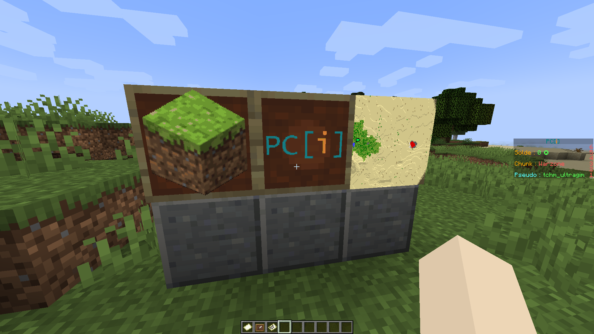

# Plugin pour le serveur Minecraft de l'association PC[i]
## Fonctionalités
### Génération de cartes avec images

Permet d'envoyer une image via un navigateur web qui peut être affichée en jeu sur une carte.

### Gestion de zones
Un joueur peut revendiquer plusieurs chunks comme lui appartenant, et y appliquer différents effets, comme par exemple une protection contre les dégâts naturels.

Le propriétaire peut mettre sur liste blanche d'autres joueurs pour leur donner plus de droits sur sa zone.

### Économie
Chaque joueur possède une certaine somme d'argent qu'il peut dépenser comme il le souhaite (de joueur à joueur ou dans des améliorations de zone).

## Dépendances
- [Spigot](https://www.spigotmc.org)
- [ImageMagick](https://imagemagick.org)
    - Debian (et dérivés) : `sudo apt install imagemagick`
    - Arch Linux (et dérivés) : `sudo pacman -S imagemagick`
    - Windows (avec le [Gestionnaire de paquets Windows](https://github.com/microsoft/winget-cli)) : `winget install ImageMagick.ImageMagick`

## Contribuer au projet
Voir les détails dans [CONTRIBUTING.md](CONTRIBUTING.md).